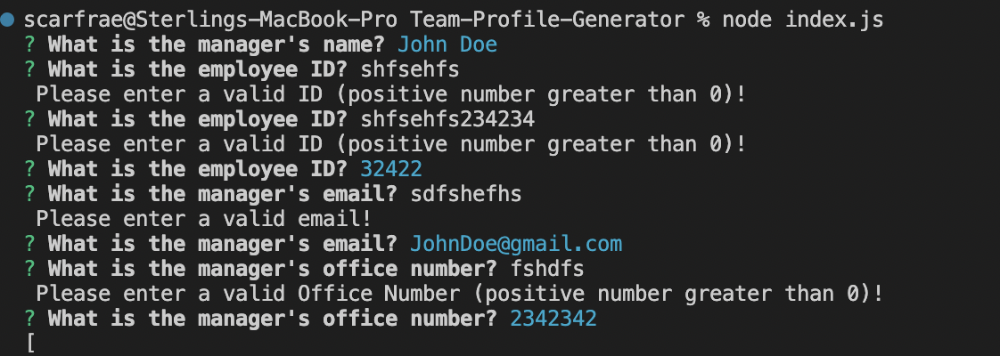
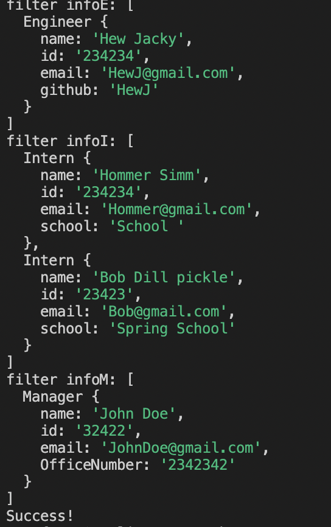
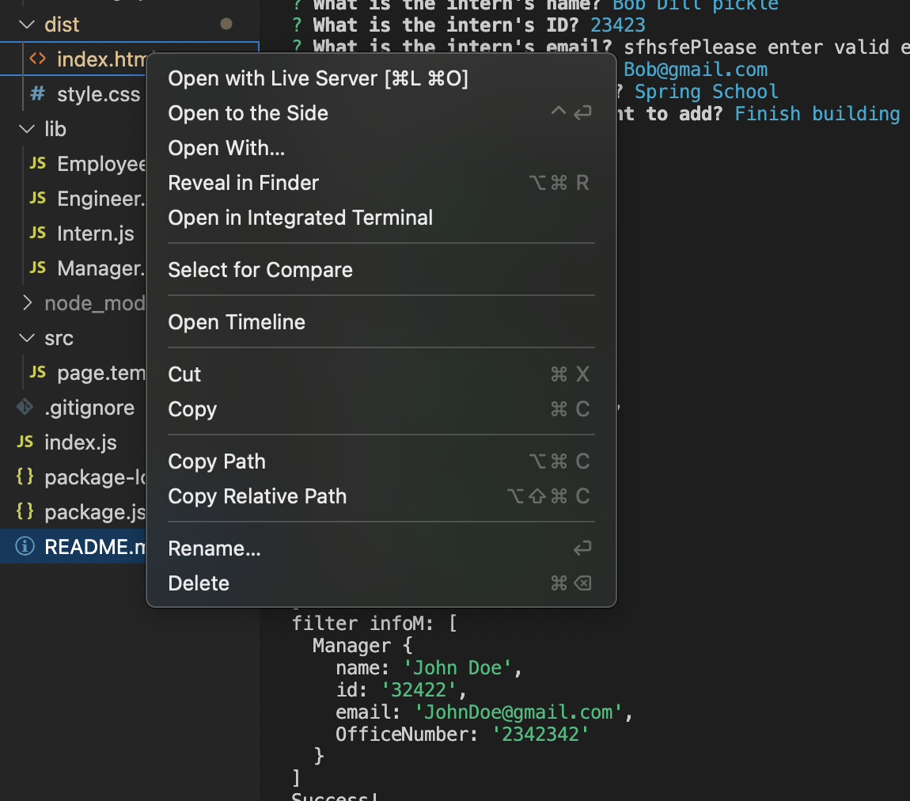
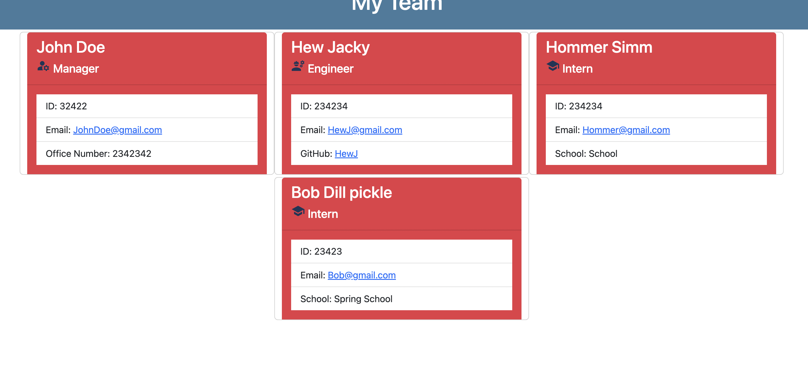
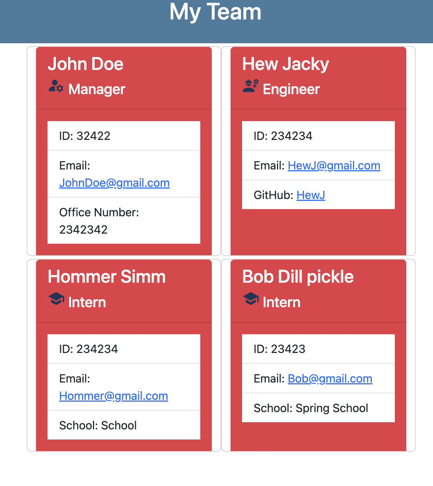
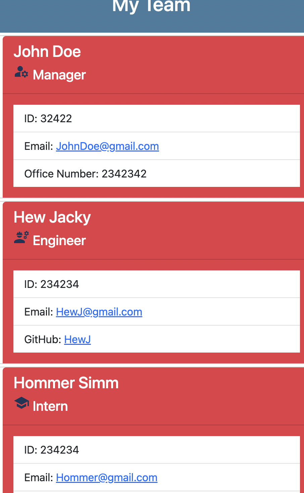
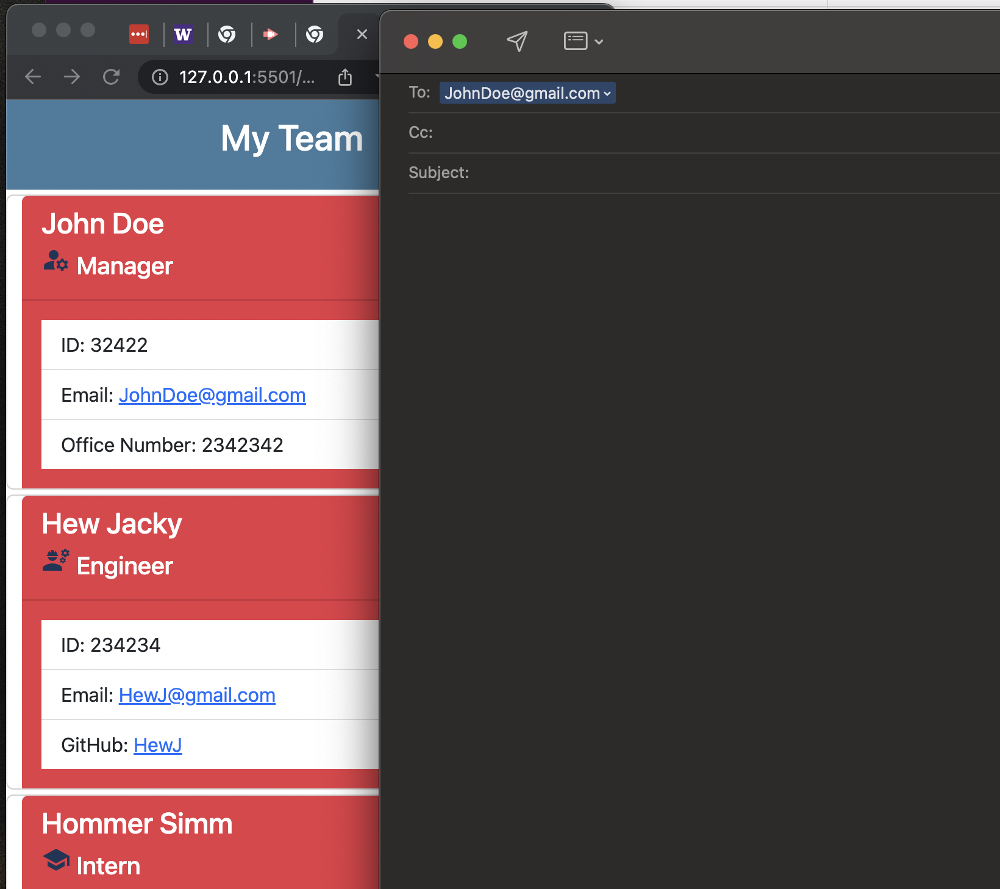
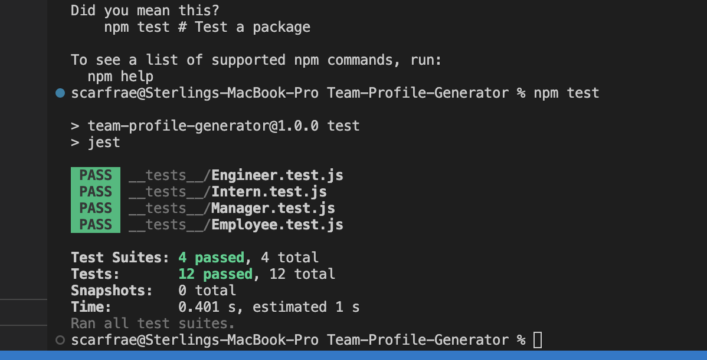

# Team-Profile-Generator
[GitHub Repository](https://github.com/scarfrae/Team-Profile-Generator)

## Description 📚

Team-Profile-Generator is a application that generates a webpage displaying a manager's team's basic info from information they have inputted in the command-line.

## Table of Contents 📄

* Installation
* Usage
* License
* Contributing
* Testing
* Technology
* Questions

---

## **Installation** ⚙️

Visit my [repository](https://github.com/scarfrae/Team-Profile-Generator) see my process of creating the application. Watch my [walkthrough video](https://watch.screencastify.com/v/chJXbjBTBzPsnjMQ7Eoq) to see how the application is used. Before starting the application install inquirer and jest in your integrated terminal using: npm i inquirer@8.2.4 and npm install --save-dev jest.

### **Usage** 💻
* To start the application invoke node index.js into the command-line
* Answer all questions to generate html file in the dist folder of the application

* Once finished you'll get a success message

* To view the webpage click on the index.html in your dist folder and open generated file in browser

* You can also click on the links!

* To run the tests invoke npm test into the command-line

### **License** 💳

MIT License

Copyright © 2022

Permission is hereby granted, free of charge, to any person obtaining a copy of this software and associated documentation files (the "Software"), to deal in the Software without restriction, including without limitation the rights to use, copy, modify, merge, publish, distribute, sublicense, and/or sell copies of the Software, and to permit persons to whom the Software is furnished to do so, subject to the following conditions:

The above copyright notice and this permission notice shall be included in all copies or substantial portions of the Software.

THE SOFTWARE IS PROVIDED "AS IS", WITHOUT WARRANTY OF ANY KIND, EXPRESS OR IMPLIED, INCLUDING BUT NOT LIMITED TO THE WARRANTIES OF MERCHANTABILITY, FITNESS FOR A PARTICULAR PURPOSE AND NONINFRINGEMENT. IN NO EVENT SHALL THE AUTHORS OR COPYRIGHT HOLDERS BE LIABLE FOR ANY CLAIM, DAMAGES OR OTHER LIABILITY, WHETHER IN AN ACTION OF CONTRACT, TORT OR OTHERWISE, ARISING FROM, OUT OF OR IN CONNECTION WITH THE SOFTWARE OR THE USE OR OTHER DEALINGS IN THE SOFTWARE.

### **Testing** 📝
All testing was done by the developing team.

### **Technology** 💡
* Nodejs
* Inquirer
* HTML
* Javascript
* CSS
* Bootstrap
* Jest

### **Contact** ☎
* Sterling Cafrae **-** [Github](https://github.com/scarfrae)**,** [LinkedIn](https://www.linkedin.com/in/sterling-carfrae-a2a8151a5/)
...
***